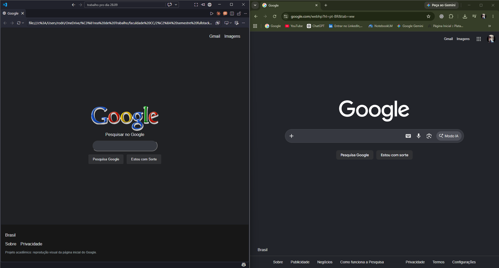

# Clone da Página Inicial do Google

**Aluno:** Rodrigo Lordi Carneiro dos Santos  
**Matrícula:** 1111500  
**Disciplina:** Front-End  
**Professor:** Matheus Henrique Barquette  
**Referência:** https://www.google.com/

## Sobre o projeto

Este projeto é uma reprodução visual da página inicial do Google em modo escuro. O objetivo foi praticar HTML semântico, CSS, responsividade, acessibilidade, formulário e Git.

## Checklist de requisitos

### 1.1 Estrutura HTML semântica e acessível

- [x] Usei os elementos semânticos `header`, `nav`, `main` e `footer` para organizar a página.
- [x] O logotipo possui o texto alternativo `Logotipo do Google`, permitindo sua descrição por leitores de tela.
- [x] O formulário possui um `label` associado ao campo de busca por meio de `for="busca"` e `id="busca"`.
- [x] As áreas de navegação possuem `aria-label`, identificando os links do cabeçalho e do rodapé.
- [x] O formulário é funcional: o usuário digita uma busca e é direcionado aos resultados do Google.

### 1.2 Fidelidade visual à referência escolhida

- [x] A página possui fundo escuro, semelhante à versão escura do Google.
- [x] Foram adicionados os links Gmail e Imagens no cabeçalho.
- [x] O conteúdo principal possui logotipo, campo de busca e botões centralizados.
- [x] O rodapé contém o país e links semelhantes aos presentes na referência.
- [x] A fonte Arial foi usada como alternativa gratuita e semelhante à tipografia sem serifa utilizada pelo Google.
- [x] O logotipo utilizado foi uma imagem PNG disponível para o projeto. Ele possui estilo visual próprio, por isso pode apresentar pequenas diferenças em relação ao original.

### 1.3 CSS: seletores, box model e estilos

- [x] Foram utilizados diversos tipos de seletores: elementos (`img`, `button`), identificador (`#busca`), classe (`.botoes`), descendente (`header nav`) e pseudo-classes (`button:hover` e `#busca:focus`).
- [x] O box model foi aplicado com propriedades como `margin`, `padding`, `border`, `border-radius` e `box-shadow`.
- [x] Foram usadas cores em hexadecimal para manter consistência visual entre fundo, textos, botões e campo de busca.
- [x] O campo de busca destaca sua borda quando recebe foco, facilitando a interação do usuário.

### 1.4 Responsividade: Flexbox e mobile first

- [x] O CSS foi construído inicialmente pensando em telas menores.
- [x] O campo de busca usa `width: 90%` e `max-width: 480px`, adaptando-se a diferentes larguras de tela.
- [x] Flexbox foi utilizado para organizar o conteúdo principal, os botões, o cabeçalho e o rodapé.
- [x] A classe `.botoes` usa `flex-wrap: wrap`, permitindo que os botões mudem de linha em telas estreitas.
- [x] Foi criada uma media query com `min-width: 768px` para ajustar o espaçamento do cabeçalho em telas maiores.

### 1.5 Personalização e originalidade

- [x] Foi adicionada uma mensagem própria no rodapé: “Projeto acadêmico: reprodução visual da página inicial do Google.”
- [x] O logotipo possui uma aparência diferente da imagem oficial, criando uma identidade visual própria para o clone educacional.

## Funcionalidades

- Campo de busca funcional.
- Pesquisa enviada ao Google usando o método `GET`.
- É possível pesquisar clicando no botão **Pesquisa Google** ou pressionando Enter.
- Botão **Estou com Sorte** incluído como elemento visual da referência.
- Links Gmail e Imagens no cabeçalho.
- Efeito visual ao passar o mouse sobre os botões.
- Campo de busca com destaque ao receber foco.

## Estrutura de arquivos

```text
.
├── imagens/
│   ├── google.png
│   └── comparacao-desktop.png
├── index.html
├── style.css
└── README.md
```

## Comparação visual



## Como executar

1. Baixe ou clone este repositório.
2. Abra o arquivo `index.html` em um navegador.
3. Digite um termo no campo de busca.
4. Clique em **Pesquisa Google** ou pressione Enter.

## Validação

- [x] HTML validado no W3C Nu HTML Checker em 28/09/2026, sem erros ou avisos.